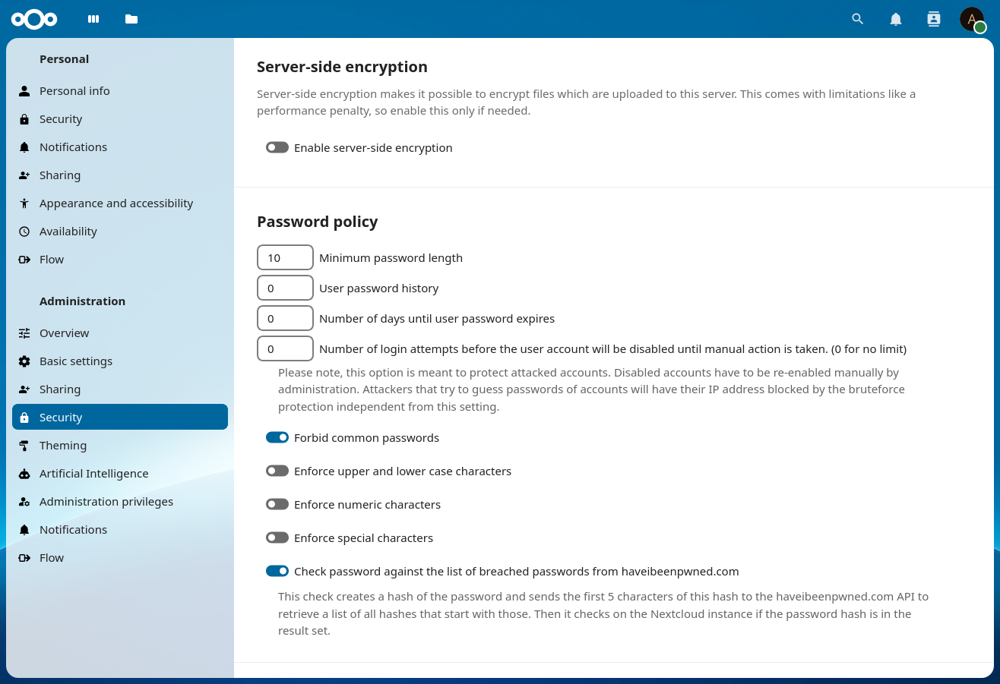

<!--
  - SPDX-FileCopyrightText: 2016-2024 Nextcloud GmbH and Nextcloud contributors
  - SPDX-License-Identifier: CC0-1.0
-->
# Password policy

[](https://api.reuse.software/info/github.com/nextcloud/password_policy) [](https://github.com/nextcloud/password_policy/actions/workflows/phpunit-sqlite.yml)

This app enables the the admin to define certain rules for passwords, for example the minimum length of a password.

By default the app enforces a minimum password length of 8 characters and checks every password against the 1.000.000 most common passwords.

Currently the app checks passwords for public link shares and for user passwords if the database backend is used.

Once the app is enabled you find the "Password policy" settings in the admin section:



## Integrate in other apps

### Generate passwords
This app is capable of generating passwords according to the configured policy, so to create a password for your app:

````php
$eventDispatcher = \OCP\Server::get(IEventDispatcher::class);
$event = new \OCP\Security\Events\GenerateSecurePasswordEvent();
try {
  $eventDispatcher->dispatchTyped($event);
} catch (\OCP\HintException $e) {
  // ⚠️ The password generation failed, more information is set on the exception
}
$password = $event->getPassword() ?? 'fallback when this app is not enabled';
````

### Validate passwords
You can easily check passwords for your own app by adding following code to your app:

````php
$eventDispatcher = \OCP\Server::get(IEventDispatcher::class);
$password = 'the-password-you-want-to-validate';
$event = new \OCP\Security\Events\ValidatePasswordPolicyEvent($password);
try {
  $eventDispatcher->dispatchTyped($event);
  // ✅ The password is valid;
} catch (\OCP\HintException $e) {
  // ❌ The password is invalid
}
````
